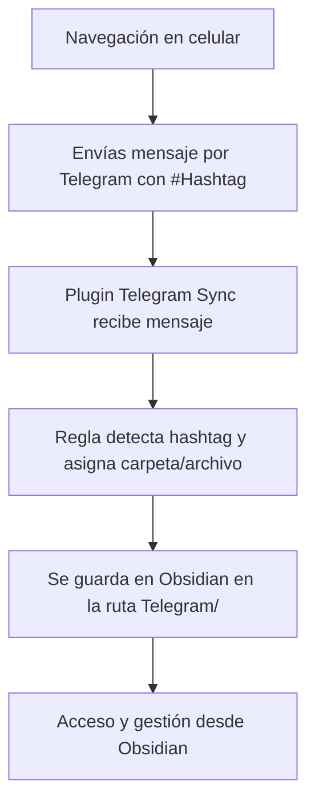

# Automatizando la captura de información desde Telegram hacia Obsidian usando hashtags

La gestión eficiente de información es clave en mi día a día como estudiante de doctorado en Ingeniería, especializado en **Knowledge Tracing**. Constantemente encuentro recursos valiosos en redes sociales: *papers*, herramientas, becas, publicaciones sobre ontologías, etc.  

Antes, me enviaba esos enlaces a WhatsApp, pero se quedaban en un limbo poco práctico para integrarlos a mi flujo de trabajo.  

Mi **centro de control** es Obsidian, acompañado de otras herramientas como **Zotero**, **Miro** y utilidades de la web 2.0., por ello, necesitaba un puente rápido y sin fricciones para llevar lo que veo en mi celular directamente a mi sistema de notas.

## La solución

Implementé el plugin **Obsidian Telegram Sync** para que, con solo enviar un mensaje en Telegram con un hashtag específico, se guarde automáticamente en la carpeta y archivo correspondientes dentro de Obsidian.

**Categorías configuradas:**
- `#papers` → Telegram/Papers
- `#tools` → Telegram/Tools
- `#becas` → Telegram/Becas
- `#PublicacionOntologias` → Telegram/PublicacionOntologias
- `#Proyecto1` → Telegram/Proyecto1  
*(y otras que puedo añadir según la necesidad)*

## Flujo de trabajo

Cuando navego en mi celular y encuentro algo de interés:

1. Abro Telegram y me envío el enlace o texto con el hashtag adecuado.
2. El plugin **Telegram Sync** detecta el hashtag y lo guarda en la carpeta correspondiente.
3. El contenido queda listo en Obsidian para su consulta o procesamiento posterior.

## Diagrama del flujo




## Beneficios

- **Velocidad:** Capturo información en segundos sin interrumpir mi trabajo.
    
- **Organización automática:** Cada hashtag envía el contenido a su archivo correspondiente.
    
- **Escalabilidad:** Añadir nuevas categorías es tan simple como crear una nueva regla.
    
- **Integración total:** Todo queda en Obsidian, mi núcleo de gestión de conocimiento.
    

## Cómo hacerlo tú mismo

1. **Instala el plugin** [Obsidian Telegram Sync](https://github.com/soberhacker/obsidian-telegram-sync).
    
2. **Crea reglas** para cada hashtag:
    
    - Ejemplo:
        - _Message filter_: `{{content~#papers}}`
        - _Note path template_: `Telegram/Papers.md`
    - 

3. **Activa Append Mode** (Reverse order) para que todo se agregue en un mismo archivo por categoría.
    
4. **Personaliza tu plantilla** (opcional, pero recomendado) para mostrar fecha, remitente y contenido, para ello use el plugin  [templater](https://github.com/SilentVoid13/Templater) aunque se puede hacer en la misma regla. 
```
---
tags: [telegram]
source: telegram
---
**{{messageDate:YYYY-MM-DD HH:mm}}**:
{{content}}

```

¡Listo! Envía mensajes con hashtags desde tu celular y obsérvalos aparecer organizados en tu vault.

Aquí cuando se envía por **Telegram**:


Aquí como se lo ve en **Obsidian**:


Este flujo de trabajo ha transformado la manera en que capturo y organizo información. Ahora, en lugar de tener fragmentos dispersos en diferentes apps, todo mi conocimiento y referencias están centralizados en Obsidian, clasificados automáticamente y listos para ser usados en mis proyectos académicos y profesionales.

Espero que les sirva!

**Marchelo2212**

## Enlaces de interés

- **Repositorio oficial del plugin Obsidian Telegram Sync**  
  [https://github.com/soberhacker/obsidian-telegram-sync](https://github.com/soberhacker/obsidian-telegram-sync)

- **Lista de variables de plantilla (Template Variables List)**  
  [https://github.com/soberhacker/obsidian-telegram-sync/blob/main/docs/Template%20Variables%20List.md](https://github.com/soberhacker/obsidian-telegram-sync/blob/main/docs/Template%20Variables%20List.md)

- **Documentación de reglas de filtrado (Message filters)**  
  [https://github.com/soberhacker/obsidian-telegram-sync/blob/main/docs/Message%20Filter%20Syntax.md](https://github.com/soberhacker/obsidian-telegram-sync/blob/main/docs/Message%20Filter%20Syntax.md)

- **Página del blog marchelo2212**  
  [https://marchelo2212.espiraleducativa.org/Home](https://marchelo2212.espiraleducativa.org/Home)

